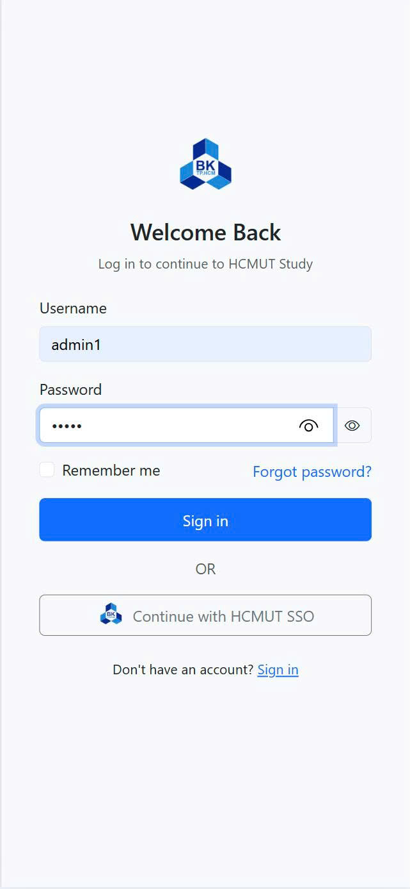
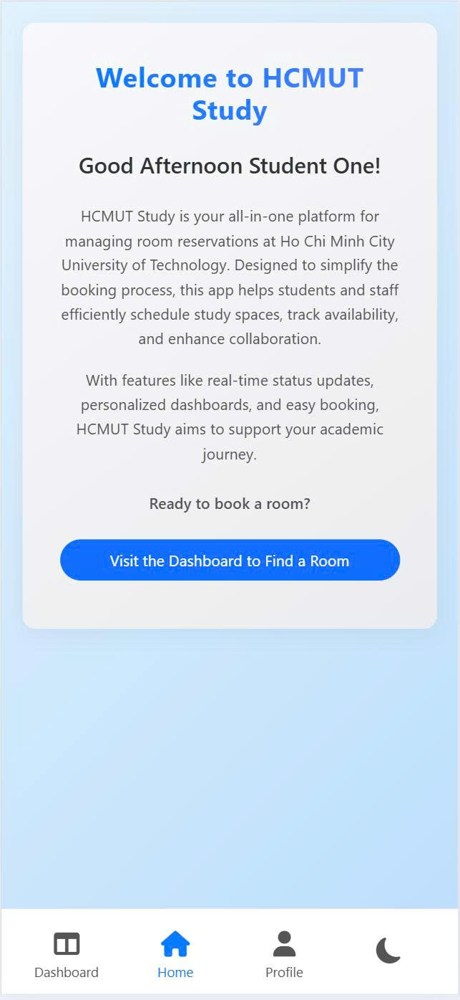
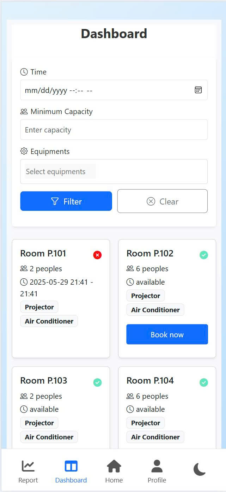
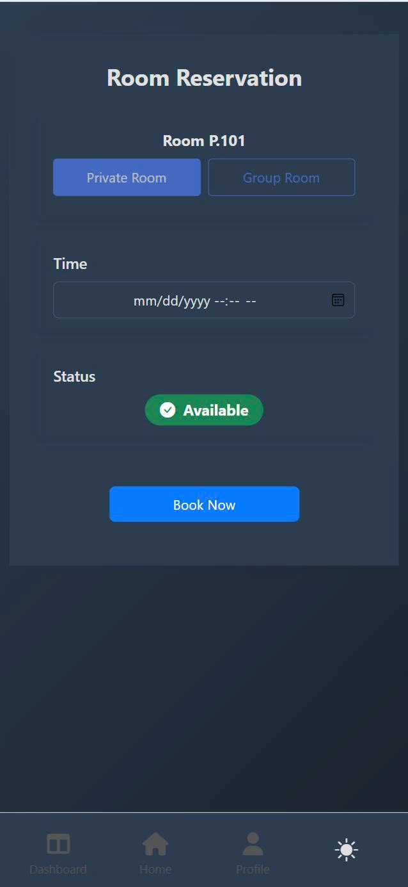
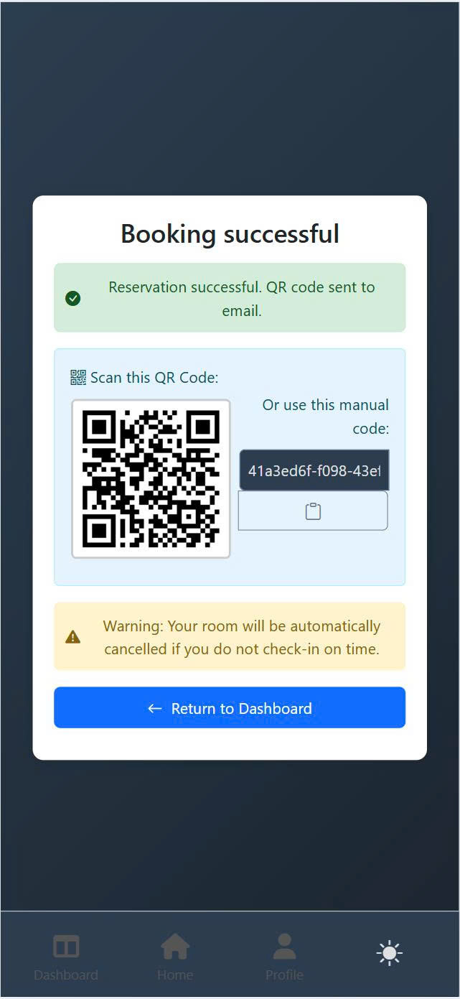
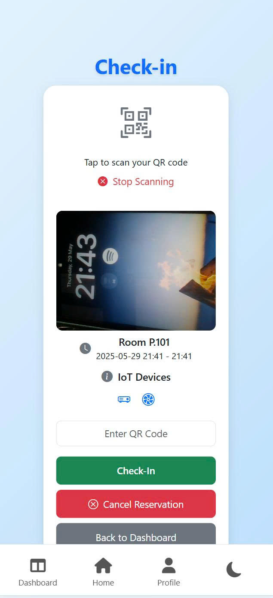
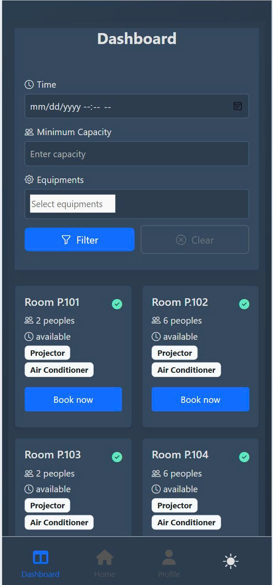
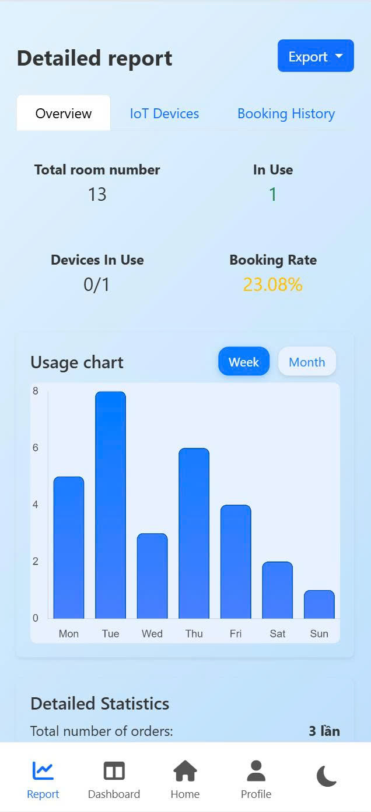

<p align="center">
 <h1 align="center">HCMUT Study Place Management System</h1>
</p>

## 🏠 Introduction
The HCMUT Study Place Management System is a web-based application designed to streamline the reservation, check-in, and management of study rooms at Ho Chi Minh University of Technology (HCMUT). This system provides an efficient solution for students and administrators to book study spaces, manage schedules, and optimize resource utilization. Built with scalability and usability in mind, it ensures seamless access to study facilities while maintaining security and administrative oversight.

## 🔹 Features
- ✅ Room Reservation: Reserve study rooms with specific time slots for hassle-free booking.
- ✅ QR Code Check-In: Securely check in to reserved rooms using unique QR codes.
- ✅ Room Scheduling: Manage room availability with built-in conflict detection.
- ✅ Automatic Cancellation: Automatically free up expired or unconfirmed reservations.
- ✅ User Management: Support for student and admin roles with secure authentication.
- ✅ Real-Time Status Updates: Display live room statuses (e.g., available, reserved, in use).
- ✅ Equipment Management: Track and manage room equipment, such as projectors and air conditioners.
- ✅ Responsive Design: Fully responsive interface, optimized for both desktop and mobile devices, ensuring a seamless experience across all screen sizes.

### 🔍 Feature Screenshots

<table>
  <tr>
    <td align="center">
      <br/>
      <i>Room Reservation</i>
    </td>
    <td align="center">
      <br/>
      <i>Hello User Screen</i>
    </td>
    <td align="center">
      <br/>
      <i>Room Status</i>
    </td>
  </tr>
  <tr>
    <td align="center">
      <br/>
      <i>Booking Display</i>
    </td>
    <td align="center">
      <br/>
      <i>Booking Success</i>
    </td>
    <td align="center">
      <br/>
      <i>QR Check-In</i>
    </td>
  </tr>
  <tr>
    <td align="center">
      <br/>
      <i>Dark Mode</i>
    </td>
    <td align="center">
      <br/>
      <i>Report View</i>
    </td>
    <td></td>
  </tr>
</table>

## 🛠️ Technologies Used
- Backend: Python 3.8+, Flask/Django (or specify your framework)
- Database: SQLite (configurable with SQLAlchemy for other databases)
- Frontend: HTML, CSS, JavaScript (or specify frameworks like React, if used)
- Authentication: JWT or session-based authentication
- Other Tools: Git for version control, Pip for package management
## ⚙️ Installation
Follow these steps to set up the project locally:
1. Clone this repository
```bash
$ git clone https://github.com/T-K-Nguyen/HCMUT_Study_Place.git
$ cd HCMUT_Study_Place
```
2. Create a Virtual Environment (recommended)
```bash
$ python -m venv venv
$ source venv/bin/activate  # On Windows: venv\Scripts\activate
```
3. Run the application
```bash
$ python app.py
```

## 🚀 Future Improvements
To enhance the system’s functionality and user experience, the following improvements are planned:
- Integration with a mobile app for on-the-go reservations and check-ins.
- Support for notifications (e.g., email or SMS) for reservation confirmations and reminders.
- Enhanced analytics dashboard for administrators to monitor room usage patterns.
- Integration with university authentication systems (e.g., SSO with LDAP or OAuth).
- Advanced equipment tracking with IoT-based monitoring for real-time status updates.

## 📜 License
This project is licensed under the MIT License. See the LICENSE file for details.

## 📬 Contact
For questions or feedback, please contact T-K-Nguyen or open an issue on the repository.
